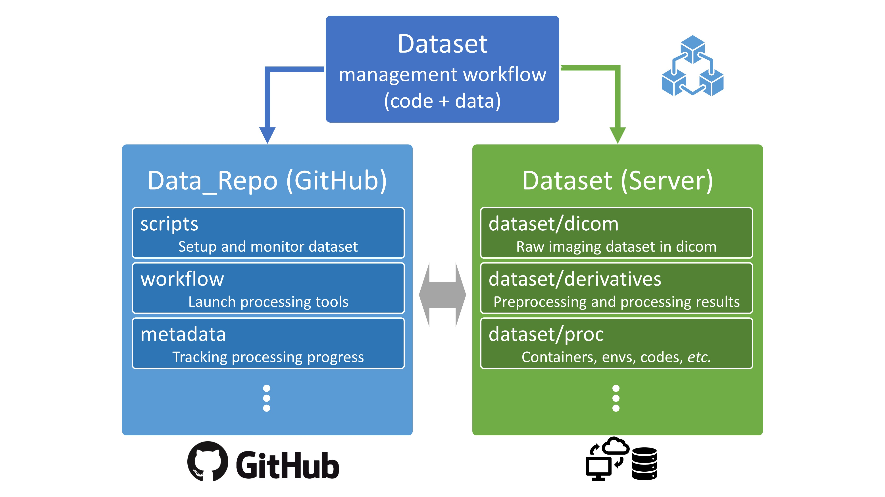
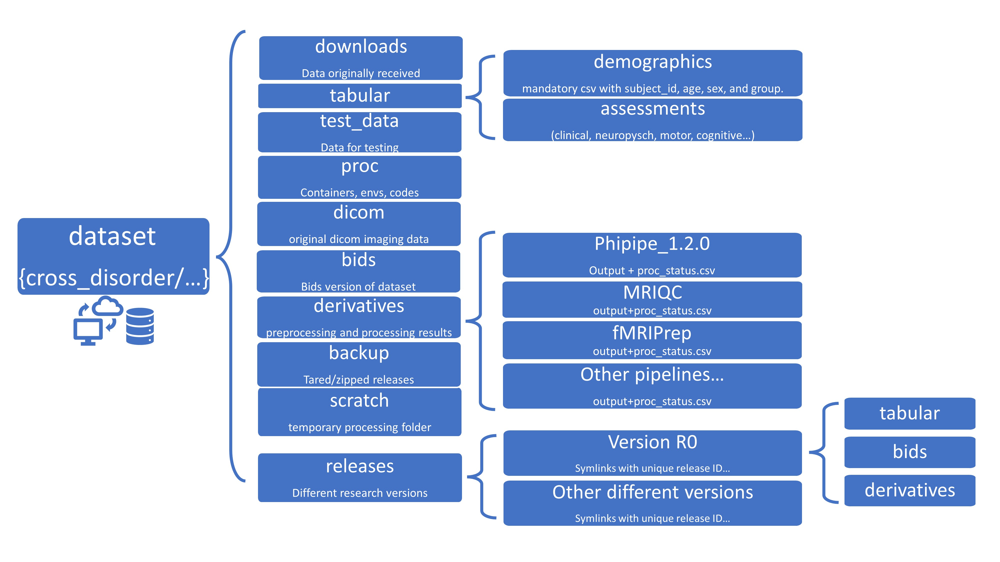

# dataset-multi_disorder

A repo for maintaining SHMC multi_disorder dataset curating and processing.

*FAIR data with elegance.*

(Findable, Accessible, Interoperable, and Re-usable)

Created by Qing Wang (Vincent) @ Imaging Core 

## dataset managment

28th, Oct., 2022

### 0. Setup dataset directory structure [Done by Qing Wang@ 28th Oct. 2022]
   - Run `scripts/folder_setup.sh` to create this directory tree. 
   - Run `scripts/folder_status.sh` check status of this dataset

### 1. Create subject manifest 
   - to be detailed [People Responsible] [Time Finish]
   - Create a `participants.csv` in `<DATASET_ROOT>/tabular/demographics` comprising at least `participant_id`,`age`,`sex`,`group` (typically a diagnosis) columns.  
   - This list serves as a ground truth for subject availability and participant IDs are used to create BIDS ids downstream.
       
### 2. Gather MRI acquisition protocols

   - to be detailed [People Responsible] [Time Finish]
   - List all the modalities and acquisition protocols used duing scanning e.g. MPRAGE, 3DT1, FLAIR, RS-FMRI etc. in the `template-dataset/workflow/dicom_org/scan_protocols.csv`
   - Although optional this is an important documentation for comparing across studies. 
   
### 3. Populate [global configs](./workflow/global_configs.json) 
   - This file contains paths to dataset, pipeline versions, and containers used by several workflow scripts.
   - This is a dataset specific file and needs to be modified based on local configs and paths.

### 4. DICOM organization (TBD)
   - to be detailed [People Responsible] [Time Finish]
   
### 5. BIDS conversion (Postponded)
   - to be detailed [People Responsible] [Time Finish]
      
### 6. Run preprocessing pipelines (TBD)
   - to be detailed [People Responsible] [Time Finish]

### 7. Run processing pipelines (TBD)
   - to be detailed [People Responsible] [Time Finish]

### Known issues
   - to be detailed [People Responsible] [Time Finish] [lOGS] 

### References

#### [mr_proc](https://github.com/neurodatascience/mr_proc) (This template is adapted from mr_proc project)

#### [PhiPipeline](https://github.com/PHI-group/PhiPipe-release)

#### [MRIQC](https://mriqc.readthedocs.io/en/stable/)

#### [SPM](https://www.fil.ion.ucl.ac.uk/spm/)

#### [TractoFlow](https://github.com/scilus/tractoflow)

#### [MAGeT Brain](https://github.com/CoBrALab/MAGeTbrain)

